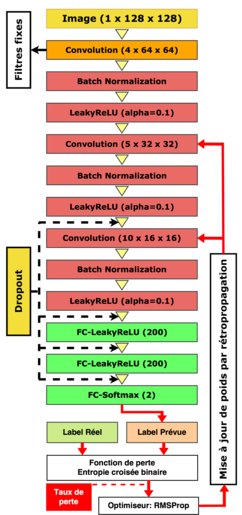

# ournée des doctorants (JdD ENIT 2018)

## Model architecture

## Experiment Results

This repository contains an implementation of image steganalysis based on the convolutional neural network.

The accuracy of model classification cross 95 % in a high payload (for 1bpp).

We use `WOW` as a steganographic algorithm to evaluate our model. 

In the figure below the training process on a high payload: 1bpp.

")

For the payload less than 1 bpp, we used the transfer learning to accelerate the model convergence.

- Experiment results of **`WOW`** :

| payload (bpp) | 1.0 | 0.9 | 0.8 | 0.7 | 0.6 | 0.5 |
| --- | --- | --- | --- | --- |
| Precision  | 95.12% | 94.25% | 92.50% | 89.75% | 87.36% | 83.25% |

## Requirement Software:

- Tebsorflow v > 1.0
- Keras v > 2.0

## Authors:

 - Marwa Saidi
 - Rabii Elbeji

License
----

MIT
